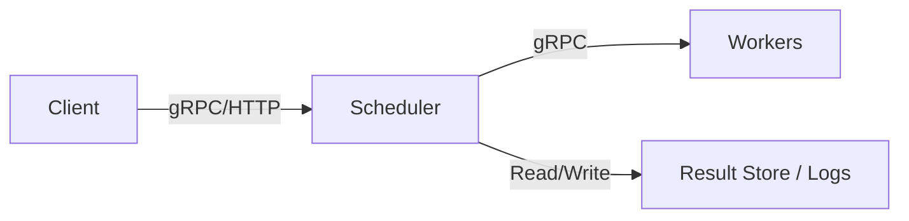

# 🧠 Distributed Job Orchestrator (in Go)

A lightweight distributed job orchestrator written in Go — inspired by systems like [Ray](https://github.com/ray-project/ray) and [Celery](https://docs.celeryq.dev/). It allows users to submit jobs to a central scheduler, which distributes them across a pool of worker nodes with retry, result tracking, and health monitoring.

## 🎯 Features

- ✅ Job submission via gRPC or REST
- ⚙️ Central scheduler with task queue
- 🏃 Distributed workers with execution engine
- 🔁 Retry failed tasks with exponential backoff
- 📦 Persistent task status and results
- 📡 Worker health checks and heartbeats
- 📊 Metrics support (Prometheus-ready)

## 🧱 Architecture



## 🛠️ Project Structure

```
distributed-orchestrator/
├── cmd/
│   ├── scheduler/         # Scheduler main service
│   │   └── main.go
│   └── worker/           # Worker node service
│       └── main.go
├── internal/
│   ├── api/              # gRPC or HTTP server setup
│   │   └── server.go
│   ├── scheduler/        # Task queueing and dispatch
│   │   ├── dispatcher.go
│   │   └── state.go
│   ├── worker/           # Worker logic
│   │   └── runner.go
│   ├── models/           # Task and job types
│   │   └── task.go
│   └── storage/          # Persistence (in-memory or DB)
│       └── store.go
├── proto/                # gRPC service definitions
│   └── orchestrator.proto
├── config/               # Configuration files
│   └── dev.yaml
├── scripts/              # Dev and demo scripts
│   └── start-dev.sh
├── go.mod
├── go.sum
└── README.md
```

## 🚀 Getting Started

1. Clone the repo
```bash
git clone https://github.com/yourusername/distributed-orchestrator.git
cd distributed-orchestrator
```

2. Run the Scheduler
```bash
go run ./cmd/scheduler
```

3. Run a Worker Node
```bash
go run ./cmd/worker
```

4. Submit a Job (Coming Soon)
```bash
# Once the API is implemented, you'll be able to submit a job like this:
curl -X POST localhost:8080/job \
  -d '{"task": "echo", "args": ["hello"]}'
```

## 🔧 Configuration

The default configuration file is located at `config/dev.yaml`. You can customize:

- `scheduler.host`: Address for the scheduler service
- `worker.host`: Address for worker nodes
- `concurrency`: Max tasks a worker can run in parallel
- `retry.max_attempts`: Retry policy for failed tasks
- `logging.level`: info, debug, or error
- `storage.backend`: In-memory or persistent (e.g., PostgreSQL)

Example config snippet:
```yaml
scheduler:
  host: "localhost:8080"

worker:
  host: "localhost:8081"
  concurrency: 4

retry:
  max_attempts: 3

logging:
  level: "info"

storage:
  backend: "memory"
```

## 📊 Metrics

This project exposes Prometheus-compatible metrics:

- Scheduler metrics available at: `http://localhost:9090/metrics`
- Worker metrics available at: `http://localhost:9091/metrics`

These include:
- Total jobs submitted
- Jobs in progress / succeeded / failed
- Task execution time (histogram)
- Retry counts
- Worker heartbeat status

You can scrape these with Prometheus and visualize them in Grafana.

## 🧩 Roadmap

- [ ] MVP with task queue, workers, scheduler
- [ ] Job submission via REST/gRPC
- [ ] Persistent task result store
- [ ] Exponential backoff retries
- [ ] Worker health checks & rebalancing
- [ ] Priority-based queues
- [ ] Support for DAGs (task dependencies)
- [ ] Cron and scheduled tasks
- [ ] Docker container-based task runners
- [ ] Web dashboard for monitoring
- [ ] Auth & TLS support
- [ ] Plugin system for task types