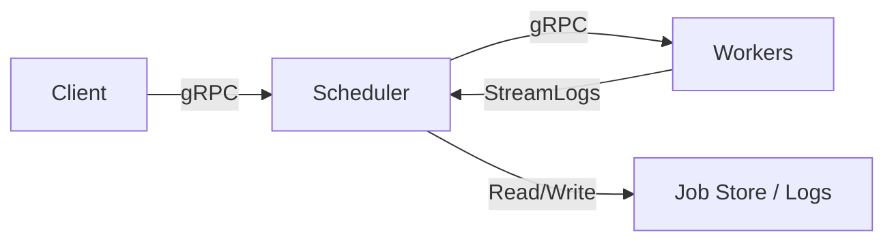

# 🧠 Distributed Job Orchestrator (in Go)

A lightweight distributed job orchestrator written in Go — inspired by systems like [Ray](https://github.com/ray-project/ray) and [Celery](https://docs.celeryq.dev/). It allows users to submit jobs to a central scheduler, which distributes them across a pool of worker nodes with retry, result tracking, health monitoring, and log streaming.

---

## 🎯 Features

- ✅ Job submission via gRPC (REST coming soon)
- ⚙️ Central scheduler with task queue
- 🏃 Distributed workers with execution engine
- 🔁 Optional retry logic with exponential backoff
- 📦 Persistent task status and results (in-memory, pluggable)
- 📡 Worker health checks and heartbeats
- 📊 Metrics support (Prometheus-ready)
- 📺 TUI dashboard to monitor jobs
- 🧪 Log streaming from workers to scheduler in real time
- 🚦 Graceful shutdown and concurrency control

---

## 🧱 Architecture



---

## 📂 Project Structure

```
distributed-orchestrator/
├── cmd/
│   ├── scheduler/       # gRPC scheduler service
│   ├── worker/          # Distributed worker node
│   ├── client/          # CLI job submission & query
│   └── tui/             # Bubbletea TUI dashboard
├── internal/
│   ├── dispatcher/      # Job queueing & dispatching
│   ├── manager/         # Worker & job state tracking
│   └── worker/          # Worker executor logic
├── proto/               # gRPC service definitions
├── config/              # Config (YAML)
├── Dockerfile.*         # Dockerfiles for each service
├── docker-compose.yml   # Full-stack orchestration
├── Makefile             # Local build/run helpers
└── README.md
```

---

## 🚀 Getting Started

### 1. Clone the Repo
```bash
git clone https://github.com/yourusername/distributed-orchestrator.git
cd distributed-orchestrator
```

### 2. Build and Run Locally
```bash
make build-all
make run-scheduler  # terminal 1
make run-worker     # terminal 2
make run-client     # terminal 3 (or use tui)
```

### 3. Or Use Docker Compose
```bash
docker-compose up --build
```

---

## 🧪 Usage

### Submit a Job
```bash
go run cmd/client/main.go -mode submit -task echo -args "hello,world"
```

### Query Job Status
```bash
go run cmd/client/main.go -mode status -id <job_id>
```

### Run the TUI Dashboard
```bash
go run cmd/tui/main.go
```

---

## 🔧 Configuration

Located at `config/dev.yaml`, and override values with `.env`.

Example:
```yaml
scheduler:
  host: "localhost:50051"
  metrics_port: 9090

worker:
  host: "localhost:8081"
  metrics_port: 9091
  concurrency: 4

retry:
  max_attempts: 3
  initial_backoff: "1s"
  max_backoff: "30s"

logging:
  level: "debug"
  format: "json"

storage:
  backend: "memory"
```

---

## 📡 Log Streaming

Workers stream job execution logs to the scheduler in real time via gRPC streaming:
- Line-by-line messages with timestamps
- Displayed on scheduler console (for now)
- Useful for debugging and future TUI enhancements

---

## 📊 Metrics (optional)

- Scheduler: `http://localhost:9090/metrics`
- Worker: `http://localhost:9091/metrics`

You can scrape with Prometheus and view with Grafana.

---

## 🧩 Roadmap

### ✅ Completed
- gRPC job submission and status tracking
- Worker registration and heartbeat
- Log streaming via bidirectional gRPC
- Graceful shutdown and concurrency control
- TUI dashboard (Bubbletea)
- Config-driven via YAML and `.env`
- Dockerized services with Compose
- Makefile for build/run helpers

### Infrastructure
- [x] gRPC APIs for job orchestration
- [x] Worker concurrency control
- [x] Log streaming
- [ ] Persistent backend (Postgres, Redis)
- [ ] TLS support for gRPC
- [ ] Retry with backoff policies

### UX & Dev
- [x] TUI Dashboard
- [ ] Web Dashboard (React/Next.js)
- [ ] Job filtering and sorting

### Scheduling
- [ ] Priority queues
- [ ] Scheduled jobs / cron
- [ ] DAG support (task dependencies)

### DevOps
- [x] Docker Compose
- [x] Makefile helpers
- [ ] GitHub Actions CI

---

## 🤝 Credits
This project was developed to demonstrate real-world distributed backend engineering with Go.
Inspired by open-source orchestrators like [Ray](https://github.com/ray-project/ray) and [Celery](https://docs.celeryq.dev/).

Contributions and ideas welcome!
